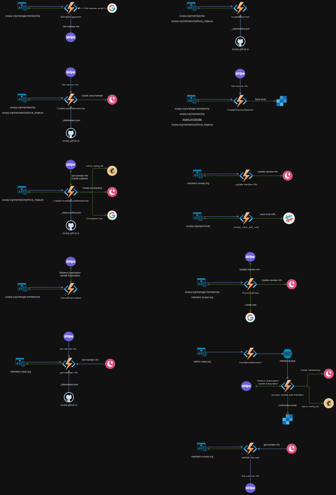

# Azure Environment
OWASP leverages a few Azure technologies in order to automate and support business processes.  This page will serve to document the backend jobs that exist today.

### Azure Subscription Details
**Subscription Name:** Microsoft Azure Sponsorship  

## Automation Account

The automation account hosts runbooks written in Python which are responsible for integrating and updating data amoungst the various systems supporting OWASP. These are all scheduled backend jobs that run nightly.

### Automation Account & Runbook Details
 **Azure Resource Group:** Staff-Administration 
 **Automation Account Name:** OWASPAutomation 
 **Github Repo:** https://github.com/OWASP-Foundation/Automations

## Automation Account

### Summary of Runbooks
| Runbook Name | Summary of Functionality |
|:---|:---|
| ChapterNightly |Updates the _data/chapters.json file for the website based on the info obtained from all the GitHub chapter repositories|
| CommunityEventsNightly |Updates the _data/communityevents.json file for the website based on the info obtained from GitHub chapter repositories and Meetup|
| EventsAndCommitteeNightly |Updates the _data/committees.json and _data\revents.json file for the website based on the info obtained from GitHub revent and committee repositories|
| EventsAndCorpMembersNightly |Copies _data/corp_members.yml to assets/sitedata/corp_members.yml and _data/events.yml to assets/sitedata/events.yml|
| LeadersNightly |Updates the _data/leaders.json file for the website based on the info obtained from all the GitHub repositories|
| MemberEmailCleanupNightly |Suspends Google accounts based on info obtained from various systems|
| ProjectsNightly |Updates the _data/projects.json file for the website based on the info obtained from GitHub project repositories|
| RepositoryNightlyBuild |Gathers data for all Github repositories and updates the RepoEntries table in the owaspadmin941c Azure Storage Account  |
| UpdateGoogleLeaderGroups |Adds all the leaders into the proper Google leader groups|

## OWASP API

The OWASP API is implemented using Azure Functions written in Python.  This API supports a lot of the functionality on the OWASP website and in the OWASP Slack workspace.

### Azure Function Details
**Azure Resource Group:** Staff-Administration 
**Function Name:** owaspadmin 
**Github Repo:** https://github.com/OWASP-Foundation/owaspadmin-azurefunctions

### Summary of API Endpoints & Supporting Components
| Functional Area | Function | Type | URLs/Slack command | Notes |
|:---|:---|:---|:---|:---|
| **Membership** |||||
|| BillingManagement | HTTP | owasp.org/manage-membership/ | Returns basic info indicating that an email with link will be sent to the email address on file |
|| CreateCheckoutSession | HTTP | owasp.org/membership/ owasp.org/manage-membership/ owasp.org/membership/force_majeure/ (not really used here)  owasp.org/donate/ | Handles membership -> Stripe -> Back to Azure function StripeWebhookProcessor   Shows member information for managing subs and provisioning email (etc)   Handles donations -> Stripe -> Back to Azure function StripeWebhookProcessor |
|| CreateLeaderMembership | HTTP | owasp.org/membership/ owasp.org/membership/force_majeure/ (not really used here) | Handles creating the free leader memberships |
|| CreateForceMajeureMembership | HTTP | owasp.org/membership/force_majeure/ | Handles creating the free 'Force Majeure' memberships |
|| CancelSubscription | HTTP | owasp.org/manage-membership/ | Cancels membership subscription |
|| get-member-info | HTTP | members.owasp.org/ | Gets the membership info displayed on index.md in the Member Portal |
|| HandleAddMembers | HTTP | admin.owasp.org | Used when adding members from a CSV file from conferences |
|| process-handle-add-members | Queue || Processes the queue item created from HandleAddMembers |
|| IsLeaderByEmail | HTTP | owasp.org/membership/ owasp.org/membership/force_majeure/ (not really used here) | Used to determine if the person trying to get Leader complimentary membership is a leader |
|| update-member-info | HTTP | members.owasp.org | Updates the PII if a member edits their info in the Member Portal |
|| IsMember | HTTP || Meant to allow third parties to verify membership provided they have an 'api key' - not currently in use |
|| member-report | HTTP || Not currently in use - see member-report-go in the azure-afgo functions |
| **Slack** |||||
|| BillingSlackBot | HTTP | /contact-lookup, /contact-details, /stripe-details | processes the given commands in stripe under staff-general |
| **Chapter** |||||
|| chapter-create | HTTP | /chapter-create | displays the chapter creation dialog in Slack which will trigger the SlackActionTrigger which puts a chapter item in the chapter queue |
|| chapter-process | Queue || takes an item from the chapter queue and processes it, producing a chapter repo, updating copper, etc |
|| chapter-report | HTTP || creates a chapter report under the staff drive in google and provides a link to it -> can time out |
|| chapter-lookup | HTTP || Originally listed as disabled; pending review of functionality |
| **Committee** |||||
|| committee-create | HTTP | /committee-create | displays the committee creation dialog in Slack which will trigger the SlackActionTrigger which puts a committee item in the committee queue |
|| committee-process | Queue | /committee-create | takes an item from the committee queue and processes it, producing a committee repo, updating copper, etc |
| **Project** |||||
|| project_create_jira | HTTP | /project-create-jira | takes the JIRA ticket ID as argument. JIRA leader names, leader emails, and leader github usernames must all be filled and having matching amount of entries. Puts a project item on the project queue |
|| project_create_jira_process | HTTP || takes an item from the project queue and processes it, producing a project repo, updating copper, etc. and responds to the JIRA ticket |
|| project-create | HTTP || Not currently used |
|| project-process | Queue || Not currently used |
|| project-report | HTTP | /project-report | creates a project report under the staff drive in google and provides a link to it -> can time out |
| **Event** |||||
|| event-create | HTTP | /event-create | displays the event creation dialog in Slack which will trigger the SlackActionTrigger which puts an event item in the event queue |
|| event-process | Queue || takes an item from the event queue and processes it, producing a event repo, updating copper, etc |
|| EventBotQueueWorker | Queue || Processes all the commands under /events |
|| EventsCheckout | HTTP || Foundation of Stripe checkout in events - not currently in use |
|| EventsSlackbot | HTTP | /events | Not currently used by staff but can produce an integrated event experience from website to checkout |
| **Miscellaneous** |||||
|| get-repo-file | HTTP || Gets a file from a repo but not currently used for anything |
|| GetMeetupEvents | HTTP || Gets events from Meetup for a group but not currently used |
|| leader-report | HTTP | /leader-report | Puts a report in the staff drive under chapters but also gives link in Slack |
|| owasp_slack_add_user | HTTP | owasp.org/slack/invite | Handles adding users to Slack |
|| report-process | Queue || processes the items created by /chapter-report and /project-report |
|| provision-zoom-email | HTTP | /provision-zoom-email | Adds the leaders in the repo given to a zoom leaders email, a zoom group, and emails them all telling them how to access |
|| provision-zoom-process | Queue | /provision-zoom-email | Does the actual work for the /provision-zoom-email command |
|| ProvisionEmail | HTTP | owasp.org/manage-membership /members.owasp.org/ | Provisions email address for OWASP members |
|| rebuild_milestones | HTTP | /rbsp | Rebuild www-staff milestones but this is no longer used |
|| rebuild-site | HTTP | /rebuild-site | Does a 'full' rebuild of all www- OWASP pages (github is flaky and may skip them). Only use overnight is suggested. |
|| RunCurrentTests | HTTP | /rebuild-site | Not used at this time |
|| SlackActionTrigger | HTTP || Processes items for chapter-create, project-create, committee-create, event-create, and various /events items |
|| stripe-customer-cleanup | Timer | Nightly | Runs nightly to clean up spam customers in Stripe. Does not always complete as there are alot of spam customers. They are customers created with 0 metadata, 0 dollars spent, etc. |
|| StripeQueueWorker | Queue | nightly | Does all the actual work for handling things that go through stripe including membership, donation, subscriptions |
|| StripeWebhookProcessor | HTTP || Handles the webhooks from Stripe for checkout.session.completed, product.created, sku.created, sku.updated, order.created, charge.refunded, invoice.paid Many of these things (product, sku based) were used in the /events flow |
|| validate-otp-user | HTTP || Cloudflare validater for logging into members.owasp.org, for instance. |
|| contact-lookup | HTTP || originally listed as disabled, but it's enabled.  Code review pending. |
|| ccontact-lookup-process | Queue || originally listed as disabled, but it's enabled.  Code review pending. |
| **Disabled** |||||
||BuildRepositoriesEntry||||
||BuildSiteFiles||||
||BuildSiteFilesOrchestrator||||
||BuildSiteFilesStart||||
||BuildStaticWebsiteFiles||||
||BuildStaticWebsiteFilesTwo||||
||disable-owasp-emails||||
||DisableEmail1DayNotice||||
||DisableEmail7DayNotice||||
||DisableEmail15DayNotice||||
||DisableEmailVerify||||
||DisableOWASPEmail||||
||StudentMemberQueueWatcher||||
||StudentMemberWebHook||||

### API Endpoints - Website Details

